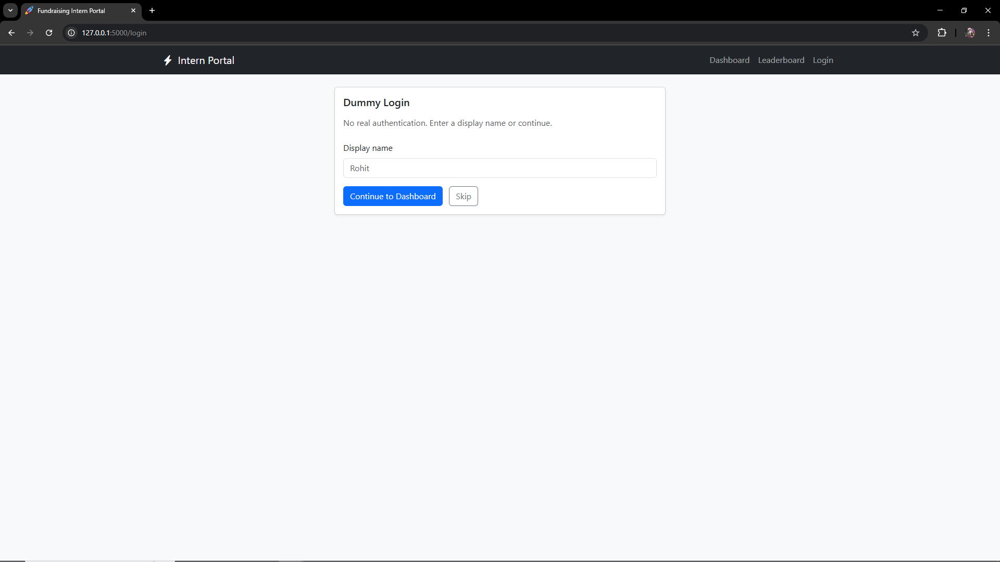
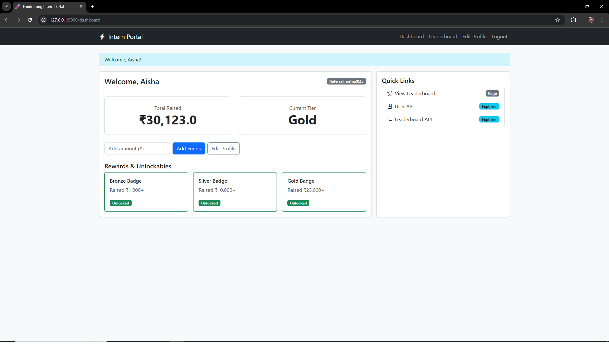
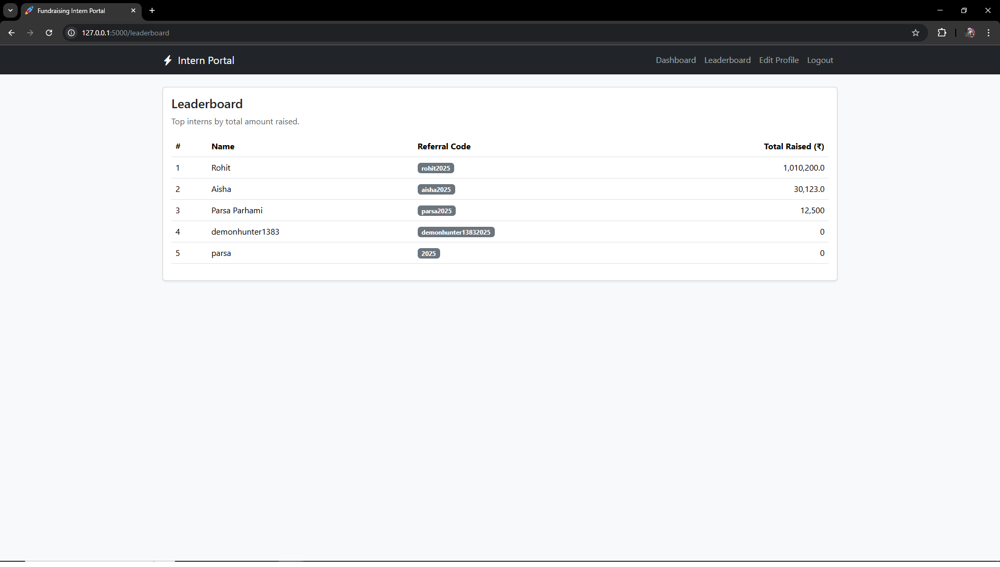
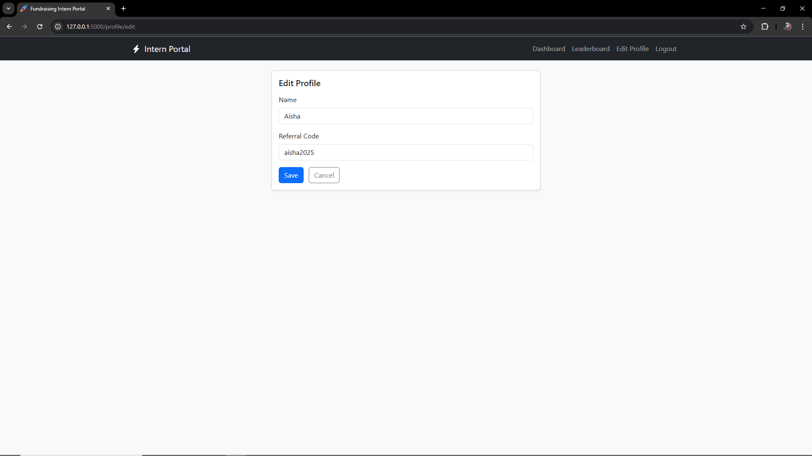

# Fundraising Intern Portal (Flask)


## Features
- Dummy **Login** (no auth)
- **Dashboard**: intern name, referral code, total raised, rewards
- **Leaderboard** page (bonus)
- **REST API** (dummy JSON)
  - `GET /api/user`
  - `GET /api/leaderboard`

## Local Setup

```bash
python -m venv venv
# Windows
venv\Scripts\activate
# macOS/Linux
# source venv/bin/activate

pip install -r requirements.txt
python app.py
```

Open: http://localhost:5000

## Data

Edit `data.json` to change the displayed values. The server reloads the file on each request.

## Deploy (Render)
1. Push this repo to GitHub.
2. Create a new **Web Service** on Render.
   - **Build Command:** `pip install -r requirements.txt`
   - **Start Command:** `gunicorn app:app`
3. After deploy finishes, copy the public URL and use it in your submission.

## API Examples

`GET /api/user`

```json
{
  "name": "Parsa Parhami",
  "referralCode": "parsa2025",
  "totalRaised": 12500,
  "rewards": [
    {"title": "Bronze Badge", "unlocked": true, "desc": "Raised ₹1,000+"},
    {"title": "Silver Badge", "unlocked": false, "desc": "Raised ₹10,000+"},
    {"title": "Gold Badge", "unlocked": false, "desc": "Raised ₹25,000+"}
  ]
}
```

`GET /api/leaderboard`

```json
{
  "items": [
    {"name": "Aisha", "referralCode": "aisha2025", "totalRaised": 18000},
    {"name": "Parsa Parhami", "referralCode": "parsa2025", "totalRaised": 12500},
    {"name": "Rohit", "referralCode": "rohit2025", "totalRaised": 9200}
  ]
}
```
## Live Demo
https://web-production-b886b.up.railway.app/login

## Routes
- /login (dummy login)
- /dashboard (requires session)
- /leaderboard
- /explorer/user, /explorer/leaderboard
- /api/user, /api/leaderboard (raw JSON)
- 404/500 error pages
## Screenshots

### Login


### Dashboard


### Leaderboard


### Edit Profile


## Tech
Flask + Jinja + Bootstrap + Bootstrap Icons, data.json, Gunicorn on Railway
